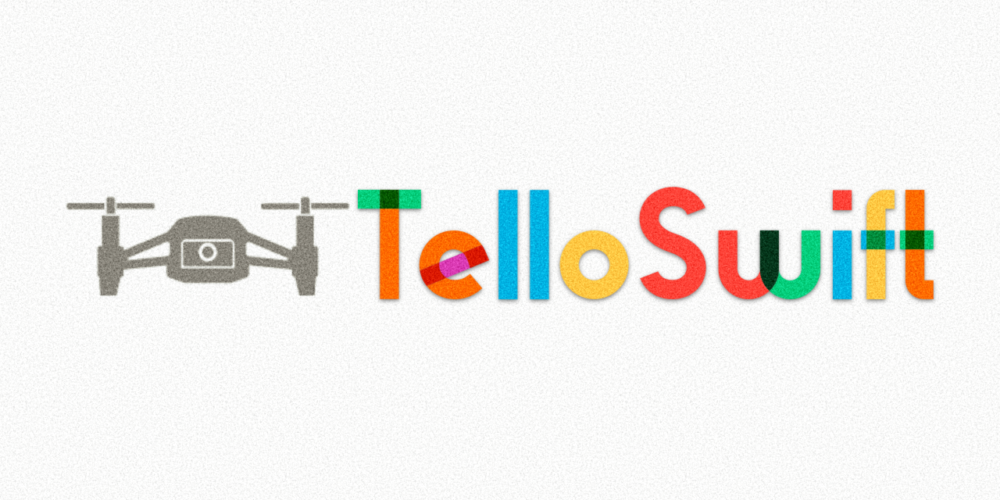

# TelloSwift  [](https://travis-ci.org/liuxuan30/TelloSwift)  [](https://codecov.io/gh/liuxuan30/TelloSwift)
A DJI Tello(plus EDU) Swift Framework, powered by Apple's [SwiftNIO](https://github.com/apple/swift-nio)



There are already a lot of Tello frameworks in Python, but I don't see a decent one for Apple's platform, especially in Swift. 

Therefore I decided to develop this framework combining latest Swift trend and replaced traditional socket programming fashion with SwiftNIO, an asynchronous event-driven network application framework for rapid development of maintainable high performance protocol.

TelloSwift is built upon SwiftNIO purely in Swift, providing flexible protocols and All-In-One Tello class that you can use to control your Tello drone. It supports both Tello and Tello EDU/IronMan edition.

## Features
* Flexible Protocol design so you can implement your own Tello controller;
* Event-driven duplex command handlers based on SwiftNIO, powering sync and async command execution;
* Many useful built-in control commands to design your own flight flow;
* Full coverage for both Tello SDK and Tello 2.0 SDK (except for swarm)
* Provide a default H264 video decoder, more details [here](https://github.com/liuxuan30/TelloSwift/tree/master/TelloVideoDecoder) 

## Requirement
* Xcode 11 / Swift 5
* iOS >= 12.0
* macOS >= 10.15*
* Ubuntu**

\*For simplicity and Catalyst, I choose 10.15, but the source code itself should support macOS since 10.13, aligned with SwiftNIO's requirement.

\*\* For Linux OS, refer Swift and SwiftNIO compatibility. 

## Installation
Just grab the source code, or add Swift package by
```swift
dependencies: [
    .package(url: "https://github.com/liuxuan30/TelloSwift.git")
]
```
Or, if your project is set up as an Xcode project and you're using Xcode 11+, you can add TelloSwift as a dependency to your Xcode project by clicking File -> Swift Packages -> Add Package Dependency.

## How to use it
To use Tello you just have to create Tello object, like
```swift
let tello = Tello()

print("connected:", tello.activate())

print("battery:", tello.battery)
if tello.battery < 20 {
    tello.shutdown()
    print("battery too low")
}

print(tello.speed)
```
By default, Tello is initialized as EDU version. If your drone is not EDU, just use another initializer such as
```swift
public convenience init(localAddr: String, localPort: Int, EDU: Bool)
```

There are several convenience initializer for your favorite.

To take off, first invoke `tello.activate()` and then simply call `tello.takeoff()`, or use convenient method:
```swift
takeoffAnd(operation: @escaping () -> Void)
```
You can even chain the command:
```swift
tello.chain("takeoff).chain("forward 20", failover: .hover).chain("land")
```
After you finished playing with your drone, simply call `tello.shutdown()`, which will close the channel and free NIO event loop resources.

**Note you should always call `shutdown()` before Tello object get deallocated.** Otherwise the threads and already associated file descriptors could be leaked.

## Architecture
Tello is assembled with multiple protocols.

### TelloCommandHandler and TelloCommander
What if the existing methods could not meet my demand?

At the heart of TelloSwift, TelloCommander is resonsible for sending tello commands either in sync or async mode. Behind the scene, TelloCommandHandler is a duplex ChannelHander, mirroring from `RequestResponseHandler` in `swift-nio-extras`.

You can replace them with your own implementations, or just get the promise from `TelloCommander.dispatchCommand()`. You can find more about `EventLoopPromise` from [NIO documentation](https://apple.github.io/swift-nio/docs/current/NIO/Structs/EventLoopPromise.html)

### TelloMotion, TelloFlightControl and MissionPadControl protocol
These protocols encapsulate commands for tello flight control. To turn on mission pad detection, simply call `tello.enable(detection: true` and `setDirection(direction: .both)`

For single flight commands taking distance argument, if the distance exceeds max value, it will automatically mod (max value + 1), if it's less then min value, it will return false. For commands only takes angles, it will mod 361.

For flight commands that involves both speed and distance like go/curve/jump, for safety purpose, TelloSwift will check if the parameter falls in to the valid range. It would also check if the command requires Tello EDU. If not satisfied, command would return false.

###  TelloState and DroneTello protocol
TelloState is the delegate protocol for receiving tello state raw string from UDP packets. Currently there are no further processing about the state string.
DroneTello is for obtaining the Tello state in real time.
To turn on state reporting, set `stateDelegate`.

### TelloVideoSteam and CameraControl protocol
It will directly forward the raw stream bytes to the delegate. To turn on the camera, just call `tello.enable(video: true)`

## TODO list
1. Swarm support
